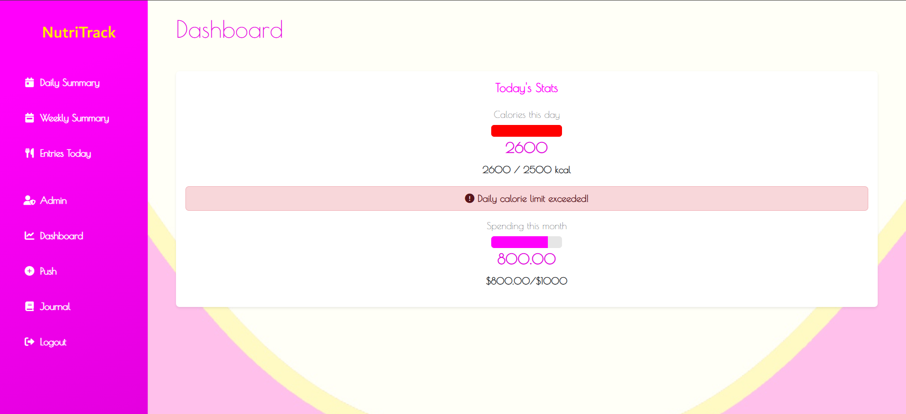

# NutriTrack App

## Përmbledhje e shkurtër
*Spring NutriTrack App* është një aplikacion i bazuar në web për gjurmimin dhe menaxhimin e marrjes së kalorive. Ai i lejon përdoruesit të regjistrohen, të identifikohen dhe të mbajnë një ditar të shënimeve të tyre ushqimore duke ofruar njohuri përmes statistikave dhe përmbledhjeve të ndryshme. Një menu administratori është e disponueshme për menaxhimin e hyrjeve dhe statistikave të përdoruesve.

## Karakteristikat

### Veprimet e përdoruesit
*Regjistrimi dhe identifikimi i përdoruesit:*
- Regjistrimi me një email dhe fjalëkalim unik.
- Identifikimi i sigurt me Spring Security.

*Dashboard:*
- *Shikoni dhe zgjidhni:*
- *Statistikat ditore:* Përmbledhje e kalorive dhe kostos për ditën aktuale.
- *Përmbledhje javore:* Statistikat e përgjithshme për 7 ditët e fundit.
- *Hyrjet e sotme:* Lista e detajuar e hyrjeve të ushqimit për ditën.

*Shto një vakt:*
- *Regjistroni hyrjet e ushqimit duke specifikuar:*
- Emrin e ushqimit.
- Numërimin e kalorive.
- Çmimin.

*Journal:*
- Filtro hyrjet e ushqimit sipas një diapazoni specifik datash.

### Veprimet e administratorit
*Dashboard i administratorit:*
- Menaxhon statistikat e përdoruesve.
- Ndryshon ose fshin shënimet e vakteve të përdoruesit.
- Hyn në të gjitha regjistrat e aktivitetit të përdoruesit.

## Teknologjitë e përdorura
- *Backend:* Spring Framework (Spring Boot)
- *Baza e të dhënave:* MySQL
- *Frontend:* Thymeleaf, HTML, CSS, JavaScript, Bootstrap
- *Autentifikimi:* Spring Security
- *ORM:* Hibernate

## Udhëzime konfigurimi

### Si fillim:
Sigurohuni që sa më poshtë janë instaluar në sistemin tuaj:
- Java (JDK 11 ose më vonë)
- Serveri MySQL
- Maven

### Hapat për të konfiguruar
1. *Klononi depon*
   bash
   git clone https://github.com/Klevis-Pllumbi/NutriTrack.git
   cd NutriTrack

2. *Konfiguro bazën e të dhënave*
- Krijoni një bazë të dhënash MySQL:
  sql
  CREATE DATABASE nutritrack;

- Përditësoni skedarin application.properties në src/main/resources me kredencialet tuaja MySQL:

  properties 

  spring.datasource.url=jdbc:mysql://localhost:3306/slimcal
  spring.datasource.username=your_mysql_username
  spring.datasource.password=your_mysql_password 
  spring.jpa.hibernate.ddl-auto=update

3. *Build the Application*
   bash
   mvn clean install

4. *Ekzekutoni aplikacionin*
   bash
   mvn spring-boot:run

5. *Access the Application*
   Open a browser and go to: http://localhost:8081

*Anëtarët e grupit:*
- Jonida Palushi ([jonidapalushi](https://github.com/jonidapalushi))
- Klevis Pllumbi ([Klevis-Pllumbi](https://github.com/Klevis-Pllumbi))
- Morena Bardhi ([Morena1803](https://github.com/Morena1803))
- Rebeka Kroji ([rebekakroji](https://github.com/rebekakroji))

## Screenshots

### Tests

### Home Page

### Login Page

### User Dashboard

### Push Entry

### Today Entries

### User Weekly Summary

### User Journal

### Admin Dashboard

### Food Entries For User (Admin Role)

### Update Nutrition Entry For User
